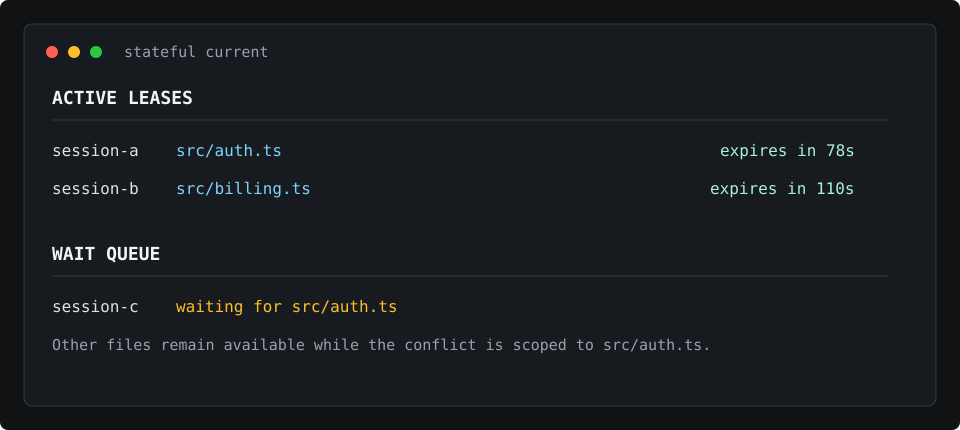

# stateful_core

Current-state coordination for coding agents and humans working in the same
repository.

Git coordinates committed history. `stateful_core` coordinates active work
before it becomes history.

Before a write occurs, tools can ask a practical question:

```text
Who is doing what now, what might conflict, and when does that claim expire?
```

The project is intentionally about current state, not long-term memory. Memory
recalls what happened before. Current state captures active, scoped, expiring
operational truth that can be checked before writes, validation, handoff, and
other coordination-sensitive actions.

Git resolves conflicts after they happen. `stateful_core` tries to prevent
avoidable conflicts before the write occurs.

## Status

This repository is an early Rust implementation and local-first prototype. The
current implementation is Codex-first and includes a CLI, global user-level
installation with repo allowlist gating, a repo-local compatibility mode, a
local HTTP state server, MCP adapter, Codex hook adapter, SQLite-backed state
store, validation runner, and benchmark tooling.

APIs, configuration files, and command behavior may change while the project is
pre-release. The current security and support scope is documented in
[SECURITY.md](SECURITY.md).

## Why

Coding agents usually know their own session, but they do not reliably know
what another agent, another session, or a human is doing in the same repository
right now. That creates avoidable failures:

- two agents edit the same file without seeing each other
- a human edits one file while an agent rewrites nearby docs
- an interrupted session leaves no structured handoff state
- stale memory is treated as active truth
- a tool writes before the session has declared its intended scope
- validation or reconciliation happens outside the coordination loop

For example, a human can be editing `README.md`, one Codex session can be
updating `docs/`, and another Codex session can be waiting for `README.md`.
The work on `docs/` can continue while the conflicting `README.md` write is
queued instead of turning into a surprise merge conflict later.

`stateful_core` provides a small protocol for declaring intent, tracking active
leases, recording session activity, reading current-state summaries, and
blocking supported writes that have no matching active intent.

## How It Fits

`stateful_core` does not replace Git, branches, worktrees, editors, or agent
runners.

- Git coordinates committed history.
- Branches and worktrees isolate longer-running lines of work.
- Editors and agent runners manage task execution and local context.
- `stateful_core` coordinates active work in a shared workspace: current
  claims, active leases, waiting sessions, and resume signals.

The current implementation is Codex-first, but the coordination problem is not
Codex-specific. Any tool that writes into a repository can benefit from a shared
answer to "who is working on this right now?"

Intent and lease are separate on purpose. Intent declares planned work and the
scope a session expects to touch. A lease declares active ownership of a scoped
resource and expires when the session stops being fresh. Intent answers "what
may this session work on?" Lease answers "who is actively holding this now?"

## Wait Queue and Resume

Write conflicts are scoped to the file or resource being modified. If session A
holds an active lease on `src/auth.ts`, sessions B and C can still read,
search, validate, or work on other files. Writes to `src/auth.ts` are blocked.

At the README level, the flow is intentionally simple:

```text
blocked -> waiting -> reserved -> active
```

A conflicting writer is blocked by the active lease and can enter a FIFO wait
queue. When the active lease is released or the owning activity finalizes, the
first waiter receives a short reservation. The reserved session must reread the
target and retry the write; that retry claims the reservation and acquires the
active lease. The default reservation TTL is 120 seconds.

Detailed queue states, lease expiry behavior, and promotion rules are covered
in the state model and implementation contract docs.

Resume signals are available through:

- `stateful notifications poll`
- `stateful resume next`
- MCP tools `state_notifications_poll` and `state_resume_next` using protocol
  names `state.notifications.poll` and `state.resume.next`
- the `/v1/notifications/poll` and `/v1/resume/next` HTTP endpoints

## What It Provides

- A `stateful` CLI for installation, repo enablement, status, current-state
  inspection, intent declaration, validation, MCP, hooks, structured commits,
  outbox sync, and server lifecycle management.
- A local HTTP state server with token-protected non-health endpoints.
- A SQLite event store and materialized current-state summary.
- Codex lifecycle hook integration for observing and gating important actions.
- An MCP adapter exposing the current-state protocol to compatible tools.
- A Codex integration path, including lifecycle hooks, MCP, and an optional
  wrapper for running Codex with a conservative read-only tmp profile.
- Repo-local validation profiles for controlled test and check execution.
- Benchmark tooling for SWE-bench pair runs, reports, comparisons, and
  synthetic coordination experiments.

## What It Is Not

`stateful_core` is not a sandbox, access-control system, file lock manager,
distributed lock service, durable secret store, or long-term memory product. It
stores shared operational state that trusted local tools can consult before
coordination-sensitive actions. See the
[security model](SECURITY.md#local-trust-model) for details.

## Install From Source

Prerequisites:

- Rust 1.85 or newer
- Git

Build the workspace:

```bash
cargo build --workspace
```

Install the CLI from this repository:

```bash
cargo install --path crates/stateful-cli
```

If you do not install it, use `target/debug/stateful` in the commands below.
The benchmark binary is built as `target/debug/stateful-bench`.

## Quick Start

Install the user-level Codex integration. Without `--yes`, this command prints
a dry-run plan.

```bash
stateful install --yes
```

Opt the current git repository into stateful enforcement:

```bash
stateful enable
```

Run Codex through the stateful wrapper:

```bash
stateful codex
```

## Useful Next Steps

Start the local server explicitly. Codex hooks also start it lazily for enabled
repos when needed.

```bash
stateful server start
stateful server status
```

Declare what you plan to edit and inspect the active current state. In
`stateful codex`, lifecycle hooks bind the current Codex session to the wrapper
run and use that run-bound session by default. Outside hooks, pass session and
workspace IDs explicitly.

```bash
stateful intent declare README.md
stateful current
```

```bash
stateful intent declare --session-id demo --workspace-id local README.md
```

Run a configured validation profile and check local installation health:

```bash
stateful validate cargo-test
stateful doctor
```

Repo-local compatibility setup is still available when global Codex config is
not desired:

```bash
stateful init --binary target/debug/stateful
stateful enable --repo-local-codex
```

## What You See



## CLI Overview

- `stateful install [--yes] [--codex-config <path>] [--binary <path>]`
  installs global stateful files and merges Codex config. It is a dry run
  unless `--yes` is passed.
- `stateful enable [--repo <path>] [--repo-local-codex]`, `stateful disable`,
  and `stateful repos list` manage the repo allowlist used by global hooks.
- `stateful init` writes repo-local `.codex/config.toml`, `.stateful/`
  configuration, and the repo-local `stateful-command-policy` skill.
- `stateful server start` starts the local HTTP state server detached by
  default. Use `stateful server start --foreground`, `stateful server status`,
  and `stateful server stop` for lifecycle control. Bare `stateful server`
  remains a foreground compatibility form.
- `stateful status` and `stateful doctor` report local setup health.
- `stateful current` prints current-state summary counts.
- `stateful events` prints recent stored state events.
- `stateful intent declare <paths...>` declares planned file or directory
  scope. Session and workspace may be explicit or inferred from the current
  hook session file.
- `stateful notifications poll` reads pending coordination notifications.
- `stateful resume next` reads the next reservation available to the active
  session.
- `stateful validate <profile>` runs a configured validation profile.
- `stateful commit -m <message> -- <paths...>` creates a structured commit for
  explicit file paths. The `--` separator is required.
- `stateful codex [--codex-bin <path>] [--sandbox read-only-tmp] [--no-stateful] -- <args...>`
  runs Codex with the stateful read-only tmp profile and rejects sandbox
  overrides. `--no-stateful` disables Codex lifecycle hooks for that run.
- `stateful mcp serve` exposes the MCP adapter over stdio.
- `stateful mcp call <tool> [arguments_json]` calls an MCP tool through the
  local HTTP server.
- `stateful sync-outbox` replays pending local outbox records to the server.
- `stateful hook <event>` runs Codex hook integration entry points.

Run `stateful <command> --help` for command-specific options.

## Write Authorization

Write authorization is the current implementation's coordination gate. It is a
policy check over shared operational state, not a security boundary or a global
file lock manager.

The v1 authorization API currently supports `write_file`, `delete_file`,
`rename_file`, and `move_file`.

File intent authorizes writes only to the exact file. Directory intent
authorizes writes one or two path segments below that directory. Delete,
rename, and move operations require exact file intents for the affected paths;
directory intent does not authorize them.

The `stateful codex` wrapper runs Codex in a read-only tmp profile, so native
Codex edit tools such as `apply_patch`, `Edit`, and `Write` are not the normal
repo write path for that mode. Repo file writes should use the stateful
structured write path, `state_file_write` / `state.file.write`, after declaring
intent. Ambiguous or mutating Bash commands are denied by default unless they
match the read-only allowlist or the trusted `stateful codex` read-only tmp
sandbox profile.

## HTTP And MCP Surface

The HTTP server exposes `/health`, `/v1/current`, `/v1/events`,
`/v1/runtime/identity`, and POST endpoints for session registration,
heartbeats, intent declaration, leases, activity observation/finalization,
authorization, conflict checks, context rendering, reconciliation ack,
validation, notifications, resume, and outbox sync.

The MCP adapter maps the same protocol to tools such as
`state_session_register`, `state_intent_declare`, `state_conflicts_check`,
`state_current_read`, `state_validation_run`, `state_notifications_poll`, and
`state_resume_next`. The protocol names use dotted forms such as
`state.intent.declare`.

Side-effecting write authorization and intent declaration endpoints require the
`stateful.v1` request envelope with `payload`. Flat legacy bodies are rejected
with `protocol_mismatch` for those paths.

## Validation Profiles

Validation profiles live at `.stateful/validation.yml`. The current runner
executes a repo-defined shell command, enforces `timeout_seconds`, reports
exit-code status, and uses `git status --porcelain` before and after the run to
fail when a path matching `denied_writes` is already dirty or becomes newly
dirty.

`allowed_writes` and `exclusive` are parsed as profile fields, but the current
runner does not yet enforce an exclusive validation lock or a full
allowlist-only write policy. Common raw test commands are still allowlisted by
the prototype Bash classifier; use validation profiles for project-specific
commands that need controlled artifact writes.

## Core Loop

```text
observe session or tool activity
-> register session and declare intent
-> acquire or refresh advisory lease
-> check conflicts against active current state
-> queue blocked conflicting writes by resource
-> block write actions without active intent
-> authorize, warn, or block remaining important actions
-> record activity and heartbeat
-> finalize as done, failed, or blocked
-> release leases on explicit release or finalization
-> reserve the released resource for the next waiter
-> notify the reserved session so it can resume
```

## Generated Local Files

`stateful_core` generates local runtime and integration files. These paths may
contain absolute paths, local configuration, runtime state, benchmark artifacts,
or bearer tokens and are ignored by default:

- `.codex/`
- `.stateful/`
- `.stateful_core/`
- `.stateful_bench/`

Global installation also writes under `$STATEFUL_HOME`, or
`$HOME/.stateful_core` when `STATEFUL_HOME` is unset. That directory can contain
`config.yml`, `state.db`, `runtime/server.json`, `runtime/server.lock`,
`runtime/server.log`, and repo metadata under `repos/`.

Commit reusable documentation and source code, not local generated state.

## Project Layout

- `crates/stateful-core`: domain types, resource scope matching, current-state
  rendering, reconciliation, Bash classification, and policy engine.
- `crates/stateful-store`: SQLite event store and current-state persistence.
- `crates/stateful-server`: local HTTP API over the shared policy and store.
- `crates/stateful-cli`: user-facing CLI, hook adapter, runtime discovery,
  repo registry, structured commit, outbox sync, and validation commands.
- `crates/stateful-mcp`: MCP tool surface.
- `crates/stateful-validation`: validation profile parser and runner.
- `crates/stateful-bench`: benchmark tooling for fetching datasets, preparing
  pairs, sampling, running paired agents, reporting, comparing, and synthetic
  experiments.
- `docs/`: concept, state model, architecture, implementation contract,
  coordination, hardening-scope, and ADR documents.

## Benchmark Tooling

`stateful-bench` currently supports:

- `fetch`: cache SWE-bench Verified rows.
- `prepare-pairs` and `generate-fallback-preflight`: build eligible pair
  manifests.
- `sample`: create deterministic stratified samples.
- `run`: execute no-state or stateful paired-agent runs.
- `report` and `compare`: summarize one run or compare stateful/no-state runs.
- `synthetic`: run the built-in synthetic coordination benchmark.

Benchmark artifacts live under `.stateful_bench/` and are intentionally ignored.

## Development

Run the Rust test suite:

```bash
cargo test --workspace
```

Some benchmark tests use ignored `.stateful_bench/agent_synthetic/` fixtures. If
those local fixtures are absent, run focused crate tests or regenerate the
benchmark fixtures before running the full workspace suite.

Run formatting and lint checks:

```bash
cargo fmt --all --check
cargo clippy --workspace --all-targets -- -D warnings
```

## Documentation

- [Core concept](docs/core-concept.md)
- [State model](docs/state-model.md)
- [Architecture](docs/architecture.md)
- [Implementation contract](docs/implementation-contract.md)
- [Current-state coordination](docs/current-state-coordination.md)
- [V1 hardening scope decisions](docs/v1-hardening-scope-decisions.md)
- [ADR 0001: State-first, not memory-first](docs/adr/0001-state-first-not-memory-first.md)

Internal implementation plans and scratch specs are intentionally kept outside
the public repository.

## License

`stateful_core` is licensed under the GNU Affero General Public License version
3.0 only. See [LICENSE](LICENSE).

Why AGPL? `stateful_core` is intended to remain open even when it is used
behind local or network services. The license is part of keeping improvements to
the coordination layer available to the people who depend on it.
