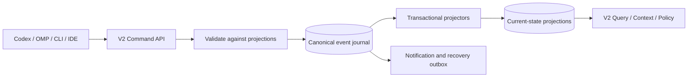

# Presence-First Event Journal V2 Design

**Date:** 2026-07-15  
**Status:** Approved for implementation planning
**Base:** `main` at `7070190`  
**Benchmark source:** selective port from `dev` at `b5e875e`

## 1. Purpose

`stateful_core` currently describes presence, freshness, and handoff as its product center, but its shipped storage and runtime remain centered on reservation, claim, queue, and write authorization. Live activity is too sparse to answer what nearby actors are doing, finalization records cleanup counts rather than a structured handoff, context delivery is effectively once per session, and existing base observations are captured near write time rather than proving what the model read.

This change makes the implementation match the presence-first product thesis:

- live actor presence is first-class current state;
- current state changes are delivered automatically by version, not by a one-time prompt marker;
- explicit and fallback handoffs survive session completion and interruption;
- exact model reads create read-to-write freshness evidence;
- broad coordination defaults to awareness;
- only thin safety edges remain hard stops;
- a canonical event journal, rather than mutable current-state tables, owns coordination truth.

The change is a clean `stateful.v2` protocol cutover. It does not retain a v1 HTTP adapter.

## 2. Goals

1. Persist one live presence record per actor and workspace, including attribution, goal, phase, relevant resources, next plan, and freshness.
2. Persist structured explicit handoffs and automatically create an honest fallback when a session stops or expires without one.
3. Correlate exact file reads with later writes and deny writes when an actual stable read has become stale.
4. Deliver relevant context when workspace state changes while avoiding repeated unchanged prompt injection.
5. Make awareness the default mode while retaining enforcement as an opt-in strict mode.
6. Make a typed event journal the canonical state source and prove that projections rebuild from it.
7. Preserve existing persistent product state through a one-time snapshot-seed migration.
8. Selectively port the real-world Docker runner and complete a scoped `requests` three-arm run.

## 3. Non-goals

- Stateful does not become a task scheduler, planner, or work allocator.
- Stateful does not replace Git branches, worktrees, containers, review, or merge integration.
- This change does not implement distributed consensus or a multi-writer database.
- This change does not claim that awareness is statistically superior from one benchmark trial.
- This change does not migrate or reuse a `v0_main` benchmark database.
- StatefulBench arms and trials do not share runtime state.
- Journal compaction is not implemented in the first v2 release.
- Search, glob, directory listing, or partial-symbol results do not count as exact write baselines.

## 4. Decisions

| Area | Decision |
| --- | --- |
| Product center | Presence, freshness, and handoff |
| Storage | Canonical append-only typed journal plus deterministic projections |
| Default mode | Awareness |
| Strict mode | Enforcement remains opt-in |
| Missing read evidence | Warn and allow, subject to other safety checks |
| Actually stale read evidence | Hard deny in both modes |
| Handoff fallback | Advisory explicit finalization plus automatic `unknown` fallback |
| Goal capture | First prompt, whitespace-normalized and length-limited; explicit update may replace it |
| Context delivery | Workspace state-version cursor |
| Protocol | `stateful.v2` clean cutover; remove v1 routes/envelopes |
| Legacy persistent DB | One-time physical backup plus logical snapshot-seed migration |
| Benchmark DB | Fresh database per arm/trial; no migration |
| Journal retention | Canonical v2 events retained indefinitely |
| Scoped benchmark | `requests`, three arms, one trial, `openai-codex/gpt-5.6-terra`, high thinking |

## 5. Architecture



The existing crate layering remains:

- `stateful-core` owns protocol envelopes, typed command/event/state models, policy primitives, and context rendering rules.
- `stateful-store` owns journal append, projection application, replay, migration, idempotency, and SQLite transactions.
- `stateful-server` owns v2 command/query routes, policy orchestration, version invalidation, notification delivery, and maintenance.
- `stateful-cli` owns user commands, Codex hooks, OMP extension integration, install assets, local recovery outbox, and runtime discovery.
- `stateful-bench` owns benchmark orchestration and metrics, not product policy.

No code path may mutate a canonical projection except the projector applying a journal event in the same transaction that appended it.

## 6. Canonical Journal

### 6.1 Event envelope

Every v2 mutation uses a common envelope:

```text
event_seq           SQLite monotonic sequence
event_id            globally unique idempotency key
request_id          originating command/query idempotency key
agent_id
turn_id?
workspace_id
repo_id?
worktree_id?
root?
branch?
aggregate_kind
aggregate_id
event_type
event_schema_version
actor_id
actor_type
owner_id?
parent_agent_id?
parent_actor_id?
source_kind
source_ref
causation_id?
correlation_id?
occurred_at
affects_context
payload_json
```

`actor_type` supports `agent`, `subagent`, `human`, `system`, and `unknown`. `unknown` is required for migrated records whose attribution cannot be established honestly.

Event families cover:

- session and presence lifecycle;
- reservation, claim, wait, and write-fence lifecycle;
- read observation lifecycle;
- write outcomes;
- human observation and reconciliation;
- authorization warnings, denials, and overrides;
- explicit and fallback handoff;
- context render, delivery, and cursor advancement;
- notification and recovery delivery state;
- migration start, seed, validation, and completion.
- tool-operation and write-intent lifecycle.

### 6.2 Command transaction invariant

A command executes in one SQLite transaction:

1. deduplicate by request/event id;
2. read current projections and validate preconditions;
3. append one or more typed events;
4. apply those events through deterministic projectors;
5. advance the workspace visible version for events with `affects_context=true`;
6. append required notification or recovery-outbox events;
7. commit all effects together.

Any failure rolls back the entire command. A successful retry with the same idempotency key returns the prior result and does not append duplicate events.

Mutation `request_id` values are globally unique client-generated UUIDs. A transactional command receipt stores the route kind, HTTP status, typed response, and committed event-sequence range. Receipts are idempotency bookkeeping rather than canonical coordination projections, but they commit or roll back in the same transaction as the journal and projections. A duplicate mutation returns the frozen receipt without rerunning policy or projectors.

### 6.3 Projections

Required projections:

- `presence_current`
- `presence_resource_current`
- `reservation_current`
- `claim_current`
- `wait_current`
- `write_fence_current`
- `read_observation_current`
- `write_intent_current`
- `human_observation_current`
- `handoff_current`
- `handoff_resource_current`
- `notification_current`
- `workspace_version`
- `agent_context_cursor`

Every projection row records the event sequence that last produced it. A replay into empty projection tables must produce byte-equivalent canonical rows.

## 7. Persistent DB Migration

### 7.1 Scope

Migration applies only when a product server opens an existing persistent legacy database without the v2 migration checkpoint.

| Database | Behavior |
| --- | --- |
| Legacy persistent product DB | Run one-time snapshot-seed migration |
| New installation | Initialize v2 schema directly |
| `v0_main` benchmark artifact | Do not migrate or reuse |
| StatefulBench arm/trial DB | Initialize a fresh v2 DB |

Migration never runs on every server execution after its checkpoint exists.

### 7.2 Why legacy events cannot be replayed directly

The v1 event rows do not form a complete event store. They lack a workspace-global sequence, aggregate and causation metadata, complete actor attribution, and events for every current-state transition. Current retention also deletes old event rows by age. Therefore migration preserves existing events as non-projectable audit history and creates projectable snapshot seed events from the authoritative current tables.

### 7.3 Physical backup and exclusive preflight

Before schema mutation:

1. stop or exclude another server using the same runtime DB;
2. run SQLite integrity and schema checks;
3. validate legacy JSON, timestamps, primary keys, and supported schema version;
4. create a SQLite-consistent versioned backup using the SQLite backup API, not a raw file copy;
5. begin an exclusive migration transaction before serving endpoints.

The backup retains the source database permissions.

### 7.4 Shadow schema and audit import

Migration creates shadow v2 journal and projection tables. Existing audit rows are imported in stable `(created_at, event_id)` order as schema-v1, non-projectable legacy audit events. Their agent-local sequence and original payload are retained. The imported order is not represented as original causal order.

### 7.5 Snapshot seed mapping

| Legacy source | V2 seed | Rule |
| --- | --- | --- |
| `agents` plus live `activities` | `PresenceSnapshotSeeded` | Normalize to one presence per agent/workspace |
| `reservations` | `ReservationSnapshotSeeded` | Preserve purpose, scope, status, declaration, expiry |
| `claims` | `ClaimSnapshotSeeded` | Preserve ownership, target, action, status, expiry, legacy base hash |
| `wait_queue` | `WaitSnapshotSeeded` | Preserve request time, path, purpose, blocker, and ordering |
| `write_fences` | `WriteFenceSnapshotSeeded` | Preserve active/released/expired state |
| `human_observations` | `HumanObservationSnapshotSeeded` | Preserve confidence, hash, expiry, and reconciliation |
| recent `ActivityFinalized` audit | `LegacyHandoffSnapshotSeeded` | Use `unknown` for unavailable structured fields |
| `notifications` and `outbox` | `DeliverySnapshotSeeded` | Preserve pending delivery state |

Existing claim hashes are marked `legacy_base_observation`; they are not relabeled as proof that the model read the file.

For multiple live legacy activity rows, migration deterministically selects the row with the latest expiry, breaking a tie by activity id. It records all source activity ids in migration provenance. Missing goal, resource, next-plan, and actor fields remain empty or `unknown` rather than being invented.

Legacy finalization becomes an honest fallback handoff with `status=unknown`, empty files/tests/remaining-work fields, and preserved cleanup counts.

Seed event ids are deterministic by entity, so a retry cannot duplicate a seed.

### 7.6 Replay validation and cutover

Seed events are passed through the production projector; migration does not copy rows directly into canonical projections. It then replays the shadow journal into a second empty projection set and verifies:

- exact reservation, claim, fence, wait, observation, and delivery identity/state;
- active/expired semantics;
- queue ordering;
- resource ownership and reservation linkage;
- human reconciliation status;
- one presence per agent/workspace;
- origin event sequence on every projection row;
- byte-equivalent replay output.

Allowed normalization differences are written to a migration manifest. Any unlisted difference fails migration.

After validation, the same transaction renames shadow tables to canonical names, records `MigrationCompleted` and the schema checkpoint, removes obsolete legacy current-state tables, and commits. A crash before commit rolls back. A post-commit readiness check must pass before `/health` reports ready.

## 8. Presence

`presence_current` contains scalar actor state:

```text
workspace_id / agent_id
actor_id / actor_type
owner_id / parent_agent_id / parent_actor_id
goal_excerpt
phase
next_plan
last_result
registered_at / updated_at / expires_at / busy_until
origin_event_seq
```

`goal_excerpt` is the first prompt after whitespace normalization, capped at 240 Unicode scalar values. `last_result` stores only tool name, outcome, completion time, and an optional 240-scalar summary; it never stores full tool stdout.

`presence_resource_current` contains normalized resource relationships:

```text
workspace_id / agent_id / relative_path
relation = read | planned | touched | changed
observed_at
origin_event_seq
```

Lifecycle:

1. Session start registers or resumes presence.
2. The first prompt captures the 240-scalar, whitespace-normalized goal excerpt.
3. Exact reads and investigations update resource evidence.
4. Write intent marks planned resources.
5. Successful writes mark changed resources and last result.
6. Recognized test commands update phase to testing.
7. Hooks heartbeat the presence without creating context churn.
8. Explicit finalization, Stop fallback, or TTL expiry closes presence.

The normal rolling presence TTL is 15 minutes. A started native tool may set `busy_until` for its declared deadline, capped at 60 minutes; maintenance expires presence only when both `expires_at` and `busy_until` are past. Repeated heartbeat and repeated reads of an already-known path may refresh projection timestamps without advancing visible context version.

## 9. Structured Handoff

Explicit finalization accepts:

```text
status = done | failed | blocked | cancelled | unknown
summary
files_changed[]
tests_run[]
remaining_work[]
next_plan?
```

The server caps `summary` at 2,000 Unicode scalar values and each list at 100 entries; over-limit v2 requests fail validation rather than truncate silently.

Finalization appends, under one correlation and transaction, the handoff plus presence finalization and cleanup events for claims, reservations, waits, and fences.

If Stop occurs without an explicit handoff, the server creates a fallback from current presence:

- `status=unknown`;
- summary states that the session ended without an explicit handoff;
- changed resources are copied to `files_changed`;
- next plan is copied to remaining work when present;
- last observed result is retained.

If Stop never arrives, TTL maintenance creates the same fallback. Startup and relevant queries perform idempotent lazy expiry so a server outage cannot permanently suppress it.

Explicit handoffs remain context-relevant for seven days. Unknown fallback handoffs remain relevant for 24 hours. Expired handoffs never create live authorization decisions.

## 10. Read-to-Write Freshness

Only an exact file read creates a write baseline.

A stable observation is valid only for the same agent session and until the earliest of explicit invalidation, session finalization, or 60 minutes after the completed read. Expired evidence follows the missing-observation warning path.

Read and write lifecycle events carry the runtime tool-operation id so pre/post hooks cannot pair concurrent operations by path alone. Runtime adapters classify a read as exact only when the tool reports the entire file body without a range, structural summary, or truncation; ambiguous or partial results may update presence but never stabilize a write baseline.

```text
PreToolUse exact read
  -> ReadObservationStarted(before exists/hash/size)
Native read executes
PostToolUse exact read
  -> ReadObservationStabilized when before == after and tool succeeded
  -> ReadObservationUnstable when before != after
  -> ReadObservationAborted when the tool failed
```

Search, glob, directory, and partial LSP results may update presence investigation resources but cannot authorize a write baseline.

Before invoking any file-changing tool, authorization appends `WriteIntentStarted` and acquires its short write fence in one transaction. `write_intent_current` retains the expected path, action, pre-write state, and lease until PostToolUse records the outcome.

Before a write:

- stable observation and equal current hash: freshness passes;
- stable observation and changed current hash: hard deny in awareness and enforcement, requiring exact reread;
- missing or expired stable observation: append an authorization warning and allow, subject to other hard stops.

A successful write appends `WriteCommitted`, resolves the intent, updates changed resources, invalidates other actors' observations for the same path, and advances the visible workspace version in one transaction. A reported tool failure appends `WriteFailed` and releases the fence. A missing post-hook leaves the intent pending and drives the `WriteOutcomeUnknown` recovery path.

## 11. Coordination Modes

Awareness is the default server and install mode.

Awareness converts these broad workflow conditions to warnings:

- missing reservation;
- scope mismatch;
- missing same-reservation claim;
- reservation/claim overlap;
- inactive coordination phase;
- missing read observation.

Enforcement remains an explicit strict mode and retains reservation, claim, queue, and lazy-resume denials.

Both modes keep these thin hard stops:

- an exact stable observation is actually stale;
- a same-path write fence is active;
- a high-confidence human write is unreconciled;
- a target is invalid or malformed;
- the sandbox/security boundary denies the operation;
- the coordination server is unavailable for a file-changing write and thin safety cannot be evaluated.

Awareness overlap does not create a wait queue or lazy replay operation. It records the warning and delivers relevant context.

## 12. V2 Protocol

The clean cutover removes `/v1/*` routes and the `stateful.v1` envelope. Bundled clients and install assets move together.

Every v2 request uses a `stateful.v2` envelope containing request id, observed time, full agent identity, full workspace identity, and source reference. Route-specific bodies are typed payloads inside that envelope.

POST routes encode the envelope as the JSON request body with the typed route payload nested under `payload`. GET routes encode the same envelope fields plus typed query fields in the query string; they do not accept an implicit server-side identity.

Representative routes:

```text
POST /v2/session/register
POST /v2/presence/update
POST /v2/read/start
POST /v2/read/complete
POST /v2/activity/finalize
POST /v2/reservation/declare|request|claim|cancel
POST /v2/claim/acquire|release
POST /v2/authorize
POST /v2/human/observe
POST /v2/reconcile/ack
POST /v2/context/render
POST /v2/context/ack
GET  /v2/current
GET  /v2/events
GET  /v2/notifications/stream
GET  /v2/runtime/identity
```

`/v2/runtime/identity` reports protocol version, journal schema version, coordination mode, workspace identity/version, and capabilities. Unsupported clients receive a structured `unsupported_protocol` failure.

Model-facing tools retain their existing accurate names without `*_v2` aliases: session register/heartbeat, current/events reads, context render, activity observe/finalize, reservation declare/request/claim/cancel, claim acquire/release, reconcile ACK, notifications poll, and resume-next. Their payloads switch atomically to the v2 envelope. Internal exact-read start/complete, write-outcome, heartbeat scheduling, and context ACK operations remain hook/extension protocol rather than additional model tools.

## 13. State-Version Context Delivery

Each workspace visible version is the latest sequence of an event with `affects_context=true`.

Version advances for meaningful changes such as presence goal/phase/plan, new resource relations, handoff, reservation/claim/fence/wait changes, observation invalidation, human activity, and reconciliation. It does not advance for unchanged heartbeat, repeated freshness timestamps, render, delivery, ACK, or audit-only allow decisions.

A render request supplies `after_version`, render mode, and optional resource filters. The response supplies:

```text
from_version
workspace_version
changed
reset_required
delivery_id
items
prompt_text
```

Render does not advance the cursor. The client injects or queues the context, then acknowledges `delivery_id` and version. Delivery/ACK events do not affect visible version. A crash before ACK causes safe redelivery.

The brief renderer prioritizes:

1. required stale/human/fence actions;
2. resource-overlapping nearby activity;
3. relevant recent handoff;
4. other active presence in the workspace;
5. informational reservation/claim overlap.

It renders each changed entity's current final state rather than a raw event stream. If a version changed but no relevant item remains, the client silently acknowledges the version.

The first v2 release has no journal compaction, so `reset_required` remains false.

Brief automatic context is capped at eight items and 1,200 Unicode scalar values after priority ordering. The structured detailed query is the route for additional state; automatic delivery never silently exceeds the brief budget.

## 14. Runtime Delivery

### 14.1 Codex

- SessionStart: register, render initial context, inject, ACK.
- First UserPromptSubmit: capture goal excerpt.
- Later UserPromptSubmit: inject only when workspace version exceeds the cursor.
- Pre/Post exact read: start and complete read observation.
- Pre write: evaluate freshness and policy.
- Post write: record write outcome and changed resources.
- Stop: create fallback only when explicit handoff is absent.

The server-backed `agent_context_cursor` is authoritative. The old local boolean prompt marker is removed; a client may cache only an unacknowledged delivery id for retry and may never advance beyond the server cursor.

### 14.2 OMP

- `session_start`: register, queue initial context with `deliverAs: "nextTurn"`, ACK.
- SSE emits coalesced `context_invalidated(target_version)` notifications per target actor/workspace.
- The extension renders the delta, queues one message for the latest version, then ACKs.
- `tool_result` compares cursor and server version to recover an SSE loss.
- Pre-tool policy catches stale, fence, and human-write hard stops before a write; awareness overlap is warned and queued for the next turn.

Duplicate or out-of-order notifications are ignored by version. Context ACK failure causes redelivery rather than cursor loss.

## 15. Failure and Recovery

- Context render failure does not block read-only tools and does not advance the cursor.
- File-changing writes fail closed when the server cannot evaluate thin safety.
- Presence, handoff, and delivery failures enter the local recovery outbox with their original idempotency key.
- If a write tool succeeds but its post hook fails, the next startup/pre-tool reconciliation records `WriteOutcomeUnknown`; the same path remains blocked until filesystem state resolves that intent.
- Notification duplicates and retries are idempotent.
- Migration validation failure retains the original schema and physical backup.

## 16. Journal Retention and Diagnostics

Canonical v2 events are retained indefinitely. The age-based event deletion path is removed. Current projections may discard expired/delivered rows because their events remain replayable.

Runtime status and `stateful doctor` report:

- SQLite byte size;
- journal row count;
- counts by workspace and event type;
- oldest/newest event timestamps;
- recent growth;
- a configurable size-threshold warning, defaulting to 512 MiB.

There is no automatic journal deletion, compaction, or VACUUM in this change. Documentation must state that bounded goal excerpts, handoffs, and coordination audit remain in the local journal.

## 17. StatefulBench Port and Scoped Run

`v0_main` does not contain the real-world runner. The runner and frozen corpus are selectively ported from `dev` at `b5e875e`; dev's older coordination core and CLI changes are not merged.

Ported surface includes:

- Linux/arm64 Docker runtime, entry point, and diagnostics;
- real-world runner and its tests;
- frozen manifest, issues, repository tasks, evaluators, and references;
- real-world benchmark guide/design and running skill;
- coordination metric schema.

The runner is adapted to `stateful.v2`. `parallel-on` explicitly starts awareness mode rather than relying on an implicit default.

Scoped model-backed run:

```text
repository: requests
arms: sequential, parallel-off, parallel-on
trials: 1
model: openai-codex/gpt-5.6-terra
thinking: high
platform: linux/arm64 Docker
runtime image: identical qualified image id for all rows
runtime DB: fresh isolated HOME per row
parallel-on coordination mode: awareness
```

Before consuming model credits, qualification must clear the selected `requests` corpus and the runner's global Docker/runtime gates with the exact image id used by all three rows.

This produces three rows, not a full 90-row result. A row is evidence only when it is cleared, task agents and final reviewer complete, post-suite/evaluators/upstream suite pass, cleanup is consistent, and no diagnostic remains unclassified. Parallel-on also requires complete v2 coordination metrics.

Metrics include presence, handoff, read-observation outcomes, context versions/delivery/coalescing and prompt overhead, warnings/denials by reason, write-fence conflicts, same-path overlap/cross-agent overwrite, journal growth, wall time, tokens, tool calls, and evaluator outcomes.

The report is descriptive. It does not infer causal or statistical superiority from one trial.

## 18. Verification

### 18.1 Journal and migration

- append/project atomicity;
- idempotent retry;
- journal-only replay equivalence;
- projector failure rollback;
- v1 persistent fixture migration;
- malformed legacy row rollback;
- migration rerun no-op;
- honest unknown legacy attribution;
- absence of direct projection writes;
- absence of canonical event pruning.

### 18.2 Presence and handoff

- one presence per session/workspace;
- root/subagent/human/system attribution;
- first prompt excerpt and explicit override;
- phase/resource/next-plan updates;
- explicit handoff;
- Stop fallback;
- TTL fallback;
- transactional cleanup;
- resource-filtered handoff rendering.

### 18.3 Freshness and policy

- stable exact read;
- change during read produces unstable observation;
- actual stale observation denies both modes;
- missing observation warns and proceeds;
- awareness warns broad conflicts;
- enforcement retains strict deny/queue;
- fence, human reconciliation, invalid target, and server-unavailable writes remain hard stops.

### 18.4 Context and protocol

- semantic-only version advancement;
- heartbeat/ACK do not advance version;
- render-before-ACK crash redelivery;
- no duplicate injection after ACK;
- notification coalescing and order handling;
- Codex and OMP automatic delivery;
- v1 rejection and v2 capability handshake.

### 18.5 Two-session smoke

1. Session A exact-reads a file.
2. Session B writes it.
3. A receives version-based context.
4. A's stale write is denied.
5. A rereads and writes successfully.
6. B explicitly finalizes and A receives its handoff.
7. A expires without Stop and produces a fallback handoff.
8. The journal is replayed into empty projections and current state matches.

### 18.6 Benchmark gates

- targeted Rust and JavaScript/Python tests;
- two-session runtime smoke;
- credit-free Docker end-to-end gate;
- `requests` three-arm model-backed run with all three rows cleared.

An uncleared row is not reported as success evidence. Fix the classified failure and rerun into a fresh output directory.

## 19. Documentation Cutover

Implementation completion updates all authoritative and generated surfaces in the same change:

- README and changelog;
- core concept;
- architecture;
- state model;
- implementation contract;
- usage reference;
- ADR 0001 and ADR 0002 status/decision text;
- current-state coordination matrix;
- bundled command-policy skill and OMP/Codex templates;
- benchmark guide/design and running skill.

The documents must not describe v1 endpoints, enforcement as the default, once-per-session context, write-time hashes as model-read evidence, or cleanup-only finalization as structured handoff.

## 20. Completion Criteria

The change is complete only when:

1. the journal rebuilds every canonical projection;
2. persistent legacy product state migrates transactionally;
3. live presence is automatically delivered;
4. explicit and fallback handoffs are automatically delivered;
5. an actually stale exact read blocks a write;
6. awareness is default and enforcement is opt-in;
7. v1 protocol routes/envelopes and direct projection writes are removed;
8. canonical events are not age-pruned;
9. targeted verification and the two-session smoke pass;
10. the credit-free Docker gate passes;
11. all three scoped `requests` rows clear;
12. implementation, tests, docs, skills, templates, and benchmark metrics state the same contract.

## 21. Accepted Tradeoffs

- Clean v2 cutover breaks unbundled v1 clients instead of carrying an adapter.
- Missing read provenance remains a warning, so thin safety is strongest after an exact read.
- Indefinite journal retention favors replay correctness over bounded storage; diagnostics expose growth but do not compact it.
- Event-journal reconstruction and snapshot migration are larger than an in-place schema extension, but they remove mutable-table truth drift.
- The scoped benchmark validates integration and records costs; it does not decide statistical product superiority.
